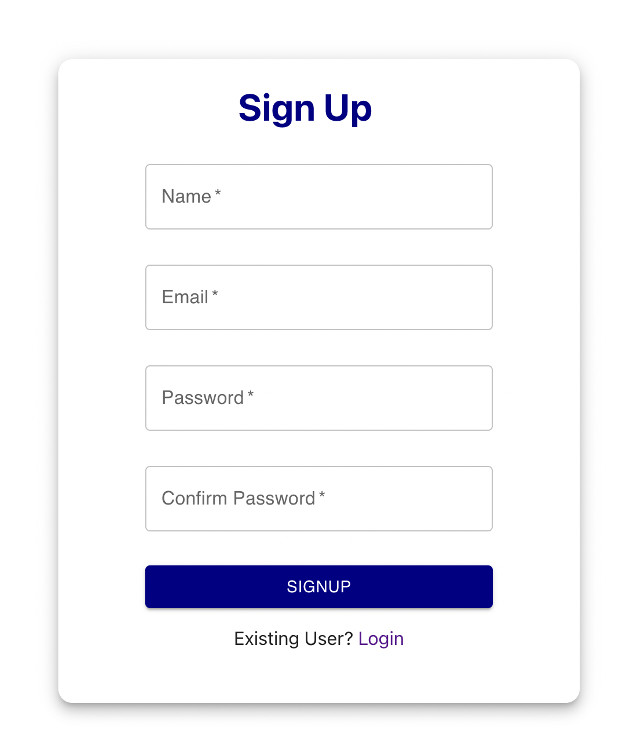
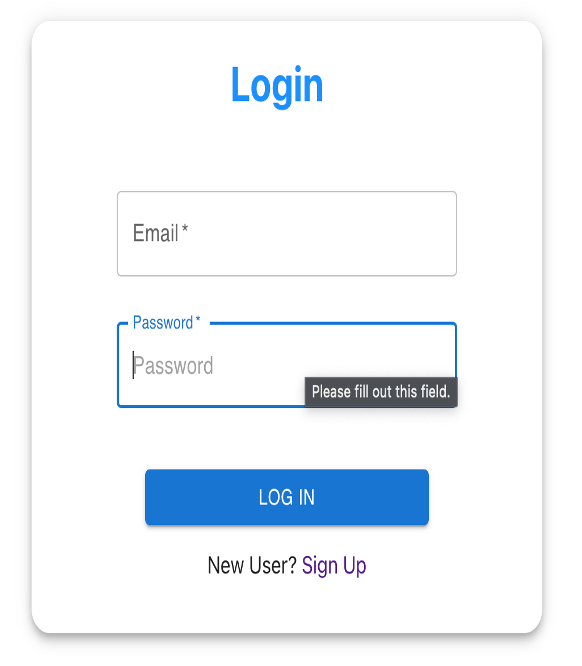
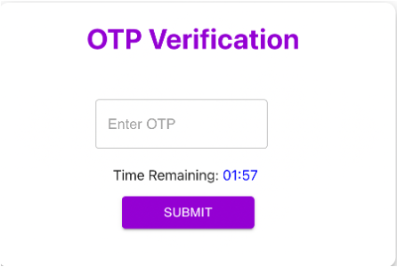
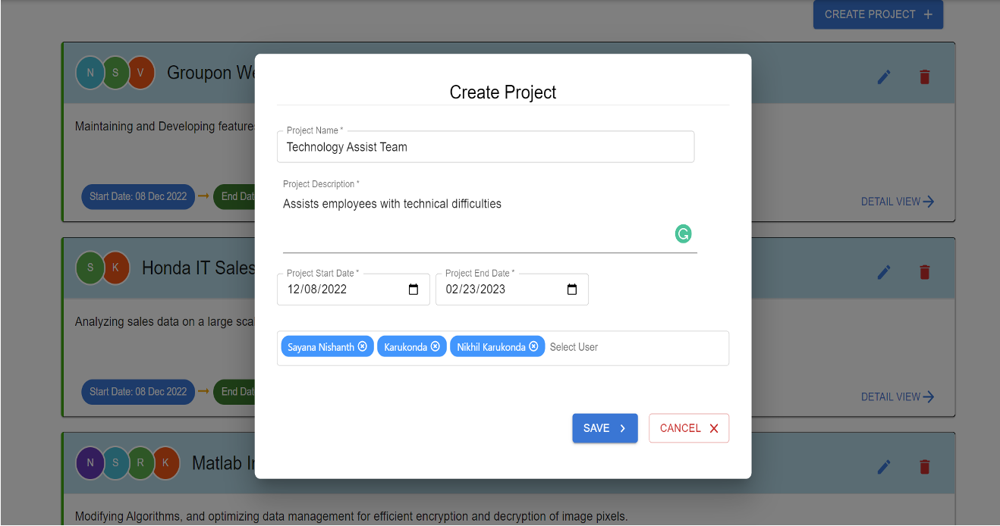
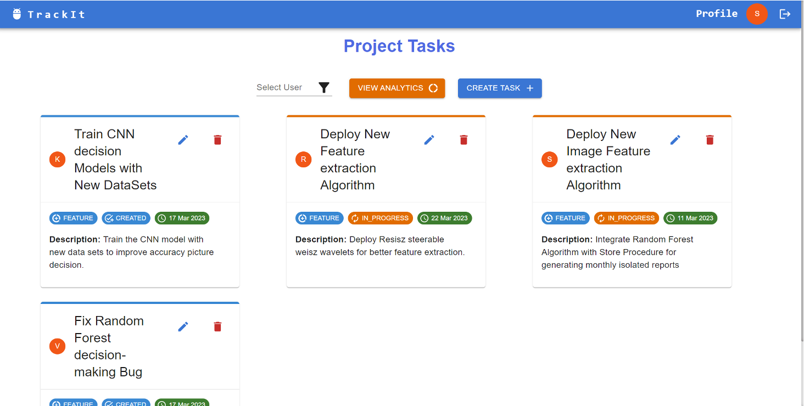
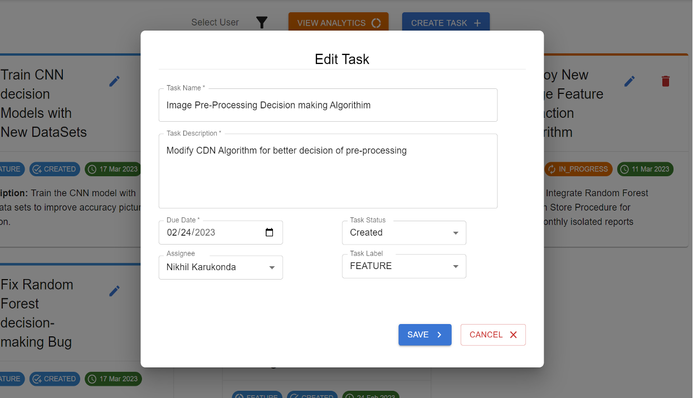
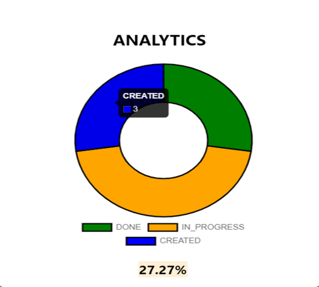

# TrackIt : Project Tracking Made Easy 🚀

TrackIT is a robust Project Management Web Application designed to streamline the process of tracking team projects, assigning user stories, and providing detailed task analysis.

### 🚀 Technologies

         

## User Requirements 📝

- **User Login/Register Page**
  - Register: User can create an account with username and password.
  - Login: Registered users can log in to their existing account.
  

      
      
      
  

- **Home Page**
  
  - View and create Project Groups.
  - Project Group admin can manage group details like adding or deleting members, updating project titles, deleting entire Project Group, etc.
  - Users can modify their profiles. By default, User will have access to groups he is part of
    

- **Project Group Details Page**
  

      
      
  

  - Display of user/project tasks.
  - Task management features and Dashboard Metrics.
  - Email notifications on task status changes.
  - Task filtering options. Users can view each task detail like task_status (Created, InProgress, Done), due_date, description, task_created_by, task_assigned_to, task_label (feature/bug)
  - Pie chart for task progress visualization in the Project Group
  

## Features 🌟

1. **Efficient Project Group Management**: Create, update, and delete project groups with ease.
2. **Dynamic Task Handling**: Add, update, or delete tasks within project groups.
3. **User-Friendly Dashboard**: A dashboard offering comprehensive metrics and a pie chart visualization of task progress.
4. **Customizable Notifications**: Automated email alerts for task status updates.
5. **Advanced Filtering**: Filter tasks by status, due date, or group member name.

## Assumptions 📌

- A user can be a member of multiple Project Groups.
- Each Project Group requires at least one user.
- A user in a Project Group can be assigned multiple tasks, but each task is unique to one user.

## Team Members 👥

- Nikhil Reddy Karukonda - `karukonda.n@northeastern.edu`
- Venkatesha Matam - `matam.v@northeastern.edu`
- Naga Venkata Nishanth Sayana - `sayana.n@northeastern.edu`
- Rahul Chowdary Kalapala - `Kalapala.r@northeastern.edu`

## Domain Model Diagram 📊

